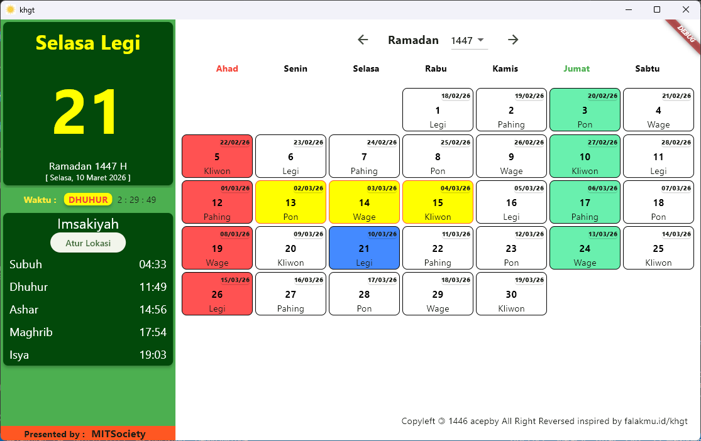

# KHGT : Kalender Hijriyah Global Tunggal

Kalender hijriyah dan Imsakiyah untuk berbagai lokasi di Indonesia



## Fitur 
- [x] Kalender Hijriyah dan Nama Pasaran
- [x] Imsakiyah untuk kota di Indoensia dengan WIB
- [ ] Imsakiyah auto timezone
- [ ] Tanggal-tanggal penting
- [ ] Konversi Tanggal Masehi ke Hijriah
- [ ] Peta kenampakan Hilal


## 🚀 Cara Install

Pastikan Anda sudah menginstal [Flutter SDK](https://docs.flutter.dev/get-started/install) versi terbaru di mesin Anda.

1.  **Clone Repositori**
    ```bash
    git clone [https://github.com/mitsociety/kalender_hgt.git](https://github.com/mitsociety/kalender_hgt.git)
    cd kalender_hgt
    ```

2.  **Instal Dependensi**
    Unduh semua package yang diperlukan (seperti `intl`, `hijriyah_khgt`, dll):
    ```bash
    flutter pub get
    ```

3.  **Jalankan Aplikasi**
    Hubungkan perangkat fisik atau nyalakan emulator, lalu jalankan:
    ```bash
    flutter run
    ```

---

## 🤝 Kontribusi

Kami sangat mengapresiasi bantuan dari pengembang lain untuk menyempurnakan kalender ini!

### Langkah Kontribusi:
1.  **Fork** proyek ini.
2.  Buat **Branch Fitur** baru:
    ```bash
    git checkout -b feature/FiturKerenAnda
    ```
3.  **Lakukan Perubahan:** Pastikan kode Anda rapi dan mengikuti pedoman Dart.
    * Jalankan `dart format .` untuk merapikan kode.
    * Pastikan tidak ada error dengan `flutter analyze`.
4.  **Commit Perubahan:**
    ```bash
    git commit -m 'feat: Menambahkan fitur X'
    ```
5.  **Push ke Branch:**
    ```bash
    git push origin feature/FiturKerenAnda
    ```
6.  **Buka Pull Request** dan jelaskan secara singkat apa yang Anda ubah atau tambahkan.

---

## 🛠 Teknologi
* **Framework:** [Flutter](https://flutter.dev)
* **Language:** [Dart](https://dart.dev)


## 📅 Referensi Perhitungan
Aplikasi ini berbasis kriteria **KHGT (Kalender Hijriah Global Tunggal)**:
- **Kriteria:** Tinggi hilal min. 5° dan Elongasi min. 8° di mana pun di permukaan bumi sebelum pukul 00:00 UTC.
- **Sumber Utama:** [khgt.muhammadiyah.or.id](https://khgt.muhammadiyah.or.id) dan [hisabmu.com](https://hisabmu.com/khgt).